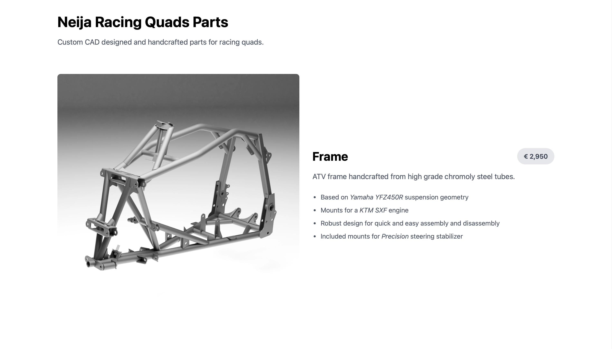
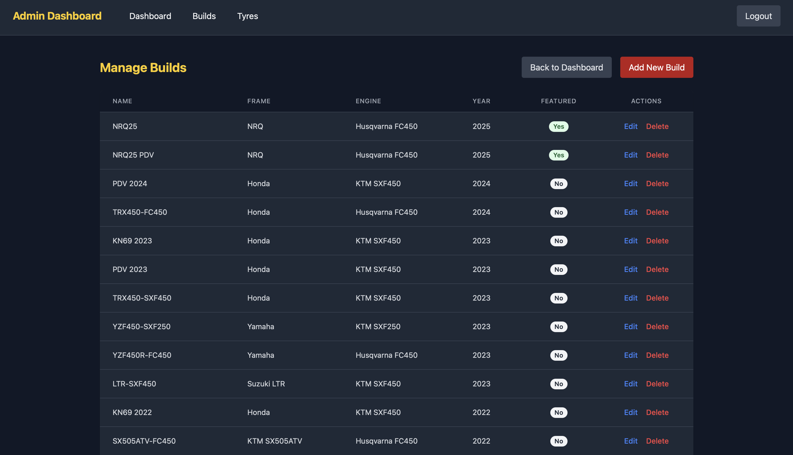

# Neija Racing Quads website

The public website for SIA NEIJA T to showcase custom-built motocross quad bikes and parts.

View live: [msport.lv](https://www.msport.lv)

## Features

- REST API with Express.js
- Responsive UI built with React + Tailwind CSS
- Secure admin dashboard for adding, editing, and managing quad builds and individual parts
- CAD designed parts rendered with Blender
- Fully deployed and maintained on a self-hosted environment
- Contact form integration
- Built with Vite, serving lightweight .webp assets to optimise performance
- Analysis tracking with Google Analytics

## Tech Stack

- **Frontend:** React, Tailwind CSS, Vite
- **Backend:** Node.js, Express.js
- **Database:** MySQL

## Screenshots

**Home**

The minimal design is focused on quality user experience and clearly presenting the most relevant content without any unnecessary distractions.

**Custom parts section**

The custom parts section is the main focus of the website displaying chasis components designed with Autodesk Fusion and rendered with Blender to showcase on the site.

**Quad build details**

Additionally, the Quad Builds section compiles a collection of completed builds over the past 10 years fetched from the database. Images are optimised to be lightweight for fast loading times. The description implements ad-hoc Markdown rendering to enable organising and styling the text.

**Racing parts catalogue**

The database also contains a list of racing parts for sale (e.g. tyres) along with their specifications. All this information is organised and displayed in the Racing Parts section.

**Admin panel builds list**

To manage the quad builds and parts there also is a secure admin panel to add and modify entries in the database.

**Admin panel build editing**

Various options are available to specify parameters while maintaining a simple interface for user experience.

